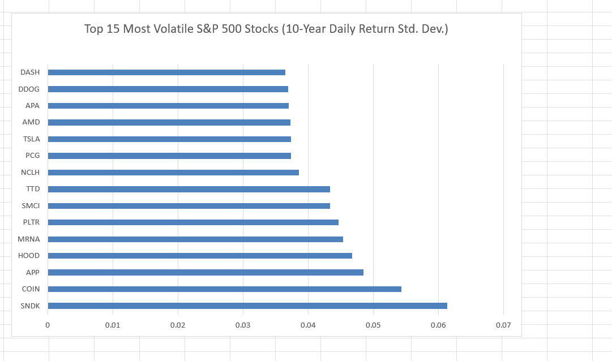
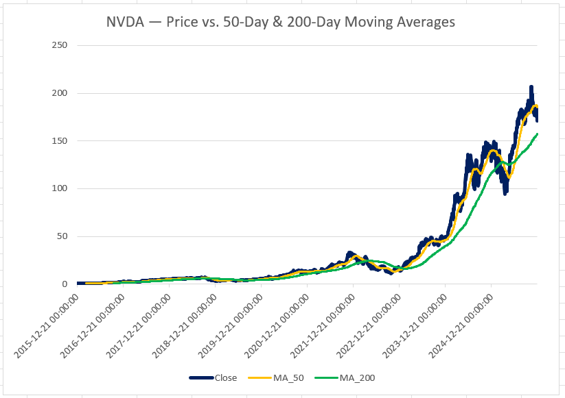
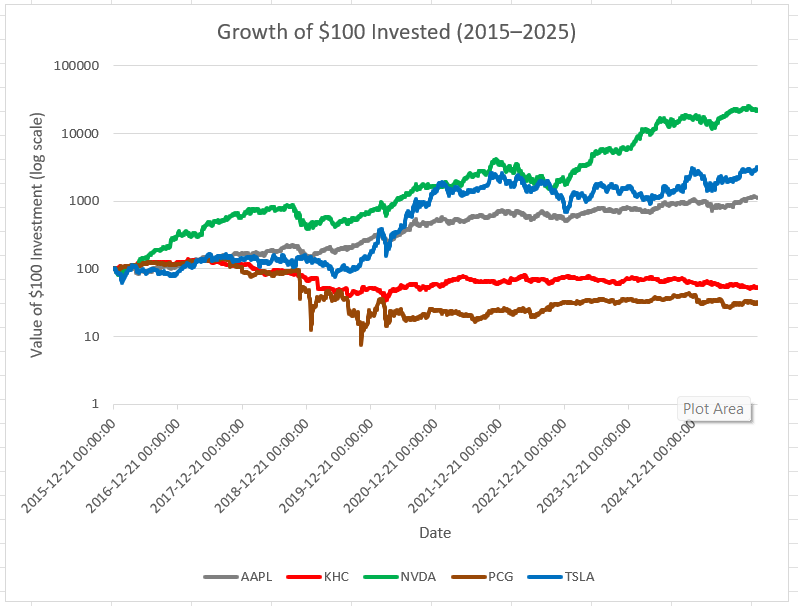
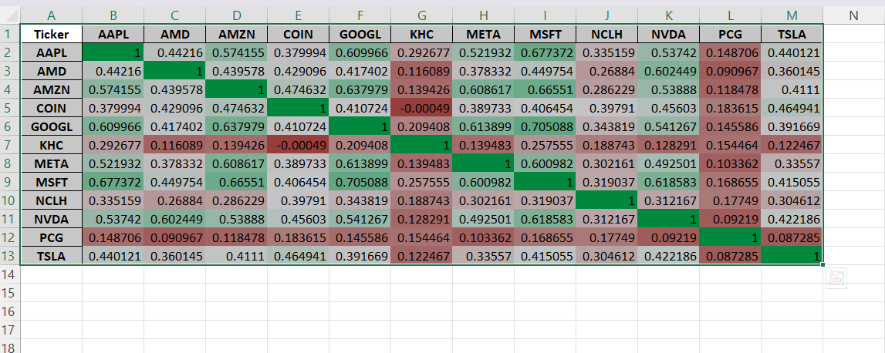

# stock-market-analytics
Analyzing 10 years of S&P 500 daily stock data to evaluate performance, risk, and correlation using Python and Excel

# Stock Market Analytics 📈

## Problem Statement
Investors and analysts need to understand not just which stocks performed well, but how much risk was taken to get there, and how different stocks move relative to each other. This project analyzes 10 years of daily price data (2015–2025) across 501 S&P 500 constituents to evaluate returns, volatility, and correlation, and builds a focused Excel deliverable for a 12-company subset spanning top performers, steady mega-caps, and underperformers.

## Objectives
- Calculate daily returns, volatility, and cumulative return for all 501 S&P 500 stocks
- Identify the most volatile stocks and the best/worst performers over the 10-year window
- Compute a simplified risk-adjusted return metric (return relative to volatility) to compare performance beyond raw returns alone
- Track daily price history with 50-day and 200-day moving averages for a focused set of 12 companies
- Build a "Growth of $100 Invested" indexed comparison to make companies with very different price scales visually comparable
- Analyze correlation between company daily returns to see how independently or together different stocks move
- Present findings through an Excel workbook with tables, charts, and a correlation heatmap

## Tools Used
- **Python** (Pandas) — Multi-file data ingestion, cleaning, and all calculations (returns, volatility, moving averages, correlation)
- **Excel** — Tables, pivoted comparison views, and charts (line charts, bar chart, conditional-formatting heatmap) as the final deliverable

## How to Run
1. Download the dataset from Kaggle (link above) and place the per-ticker CSVs in `data/SP500_Data_10Y/`
2. Install dependencies: `pip install pandas openpyxl`
3. Run `notebooks/stock-analysis.ipynb` top to bottom — it reads the CSVs, computes all metrics, and writes `excel/stock_summary.xlsx`

## Dataset
[S&P 500 Stocks — Daily Historical Data (10 Years)](https://www.kaggle.com/datasets/innacampo/s-and-p-500-stocks-daily-historical-data-10-years) (Kaggle), covering Dec 2015 – Dec 2025
- 501 individual per-ticker CSVs (`Date, Close, High, Low, Open, Volume`), merged in Python into a single dataset (~1.22 million rows)
- Note: this is U.S. equity data (S&P 500), used here for broad availability and recognizability of the companies involved — the same pipeline applies directly to other markets' data.

## Key Findings
- NVDA led on both raw cumulative return (+22,453%) and the risk-adjusted metric (7,145.6) — its volatility was high in absolute terms but not high enough, relative to its return, to lose the top spot. The risk-adjusted ranking mainly compresses the field below NVDA: AVGO climbs from 5th by raw return to 3rd risk-adjusted, and PWR and KLAC move from 9th/10th into the risk-adjusted top 10, while NVDA and AMD hold the top two spots either way.
- $100 invested in NVDA in Dec 2015 would be worth ~$22,553 by Dec 2025; the same $100 in KHC (Kraft Heinz) would be worth only ~$53.
- The most volatile stocks in the dataset (SNDK, COIN, APP, HOOD, MRNA) span crypto, fintech, and high-growth names — largely distinct from the top performers by raw return.
- Mega-cap tech stocks (AAPL, MSFT, GOOGL, META, AMZN) show moderate positive correlation with each other (~0.5–0.7) in daily returns, while KHC and PCG show weak correlation with the broader group, consistent with their sector/situation-specific drivers rather than broad market movement.

## Limitations
- **Survivorship bias**: this analysis uses the current S&P 500 constituent list applied retroactively across 2015–2025. Companies removed from the index during this period (acquired, delisted, or dropped) are not included, which likely inflates average returns and understates downside risk relative to the index's actual historical composition.
- **Risk-adjusted metric is simplified**: cumulative return ÷ volatility, not a true Sharpe ratio (no risk-free rate subtracted, not annualized).

## Project Structure

```
stock-market-analytics/
├── README.md
├── notebooks/
│ └── stock-analysis.ipynb
└── excel/
└── stock_summary.xlsx

```


## Excel Workbook Contents
- **Summary** — All 501 tickers ranked by cumulative return, with volatility and average volume; includes a volatility bar chart (Top 15 most volatile stocks)

  

- **Detail_12_Tickers** — Full daily price history, daily returns, and 50/200-day moving averages for 12 selected companies; includes an NVDA price/moving-average trend chart

  

- **Growth_Comparison** — Indexed "Growth of $100" comparison across 5 contrasting tickers (NVDA, TSLA, AAPL, KHC, PCG) on a log-scale chart

  

- **Summary_RiskAdjusted** — All 501 tickers re-ranked by a simplified risk-adjusted return metric (cumulative return ÷ volatility)
- **Correlation_Matrix** — Daily-return correlation matrix across the 12 tracked tickers, with a conditional-formatting heatmap

  
